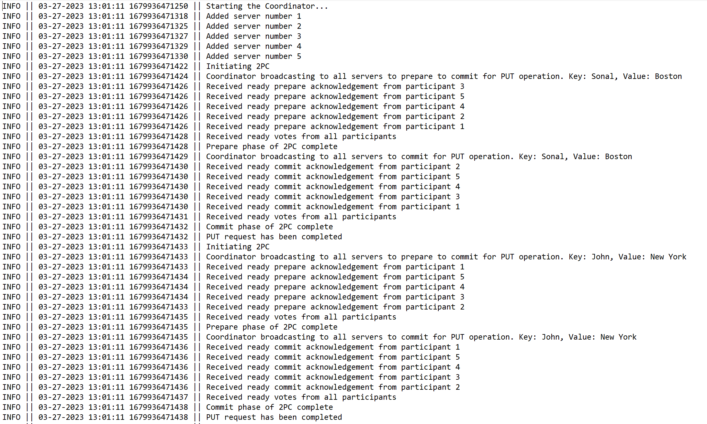
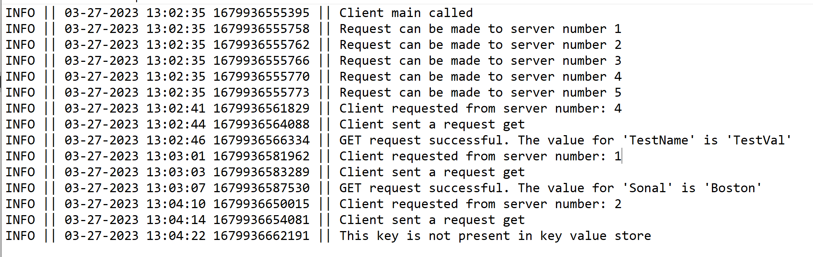

## Multithreaded Key-Value Store using RPC Communication and two-phase commit protocol

### Overview
Implementation of a multithreaded Key Value Store using Java RMI communication where multiple clients request a server
to communicate with the key value store using the following 3 operations:
- PUT (key, value)
- GET (key)
- DELETE (key)

The Key-Value store is replicated across 5 distinct servers to increase bandwidth and ensure availability. 
The clients can contact any of the 5 replicas and get consistent data from any of them. To ensure this consistency,
two-phase commit protocol is implemented for updates (PUT or DEL). 
RMI is inherently multithreaded, so each remote request from a client is a separate thread. 
ConcurrentHashMap is used to provide thread-safe access to its contents, which means that multiple threads can read and
modify the store concurrently. This ensures mutual exclusion.

The store will be pre-populated with some key value pairs once the server starts. 

### Files
1. Client - Contains the Client class that uses RMI to communicate with the server
2. Participant - Contains the implementation of the servers used in two-phase commit protocol
3. KeyValueStore - Interface that contains that methods that perform operations on the key-value store
   This interface extends Remote and contains the methods to implement GET, PUT and DELETE
4. KeyValueStoreImpl - Class that implements the above interface
5. Coordinator - Coordinates the server replicas to make sure the store is consistent using two-phase commit protocol
6. Transaction - Class to create objects of the clients' requests
7. Acknowledgement, States - Enum classes used throughout the program
8. InitialClient - Class used to prepopulate the key value store once the server starts
9. Logging - Class that handles the formatting of logging and printing logs to files
10. Logging files - Once the programs are run, Log files will be created


### How to run (with JAR files)
1. Current working directory should be Project3_Sonal/jar_files
2. In one terminal, start the registry. Run the following command:
```
rmiregistry
```
3. Open another terminal instance to start the Coordinator. This can be done using:
```
java -jar Coordinator.jar <port number>
```
4. Clients can be started on different terminal instances using:
```
java -jar Client.jar <port number>
```

### How to run (without JAR)
1. Current working directory should be Project3_Sonal/src
2. The files have to be compiled
```
javac *.java
```
3. Start rmiregistry using:
```
rmiregistry
```
4. Now the Coordinator and Client files have to be run with args
5. Start the server by passing a port number as:
```
java Coordinator.java <port number>
```
6. Clients can be started on different terminal instances using:
```
java Client.java <port number>
```

NOTE: The store is pre-populated with key value pairs once the servers start.
Few example key value pairs are: {Sonal: Boston, John: New York}...

### After starting Client and Coordinator
1. The client will prompt to enter the server number (1-5) to which it will make the request
2. The client will then prompt to enter GET, PUT or DEL (case-insensitive)
   - For GET: Client will then prompt to enter key. The response from server will be the value of the key from
     the store. If the key is not present, the server responds with a message saying the key does not exist
   - For PUT: Client will then prompt to enter key, and then value. The response from the server will be a message
     saying the store has been updated with key and value pair
   - For DEL: Client will then prompt to enter key to delete. The response from server will be a message saying the
     store has been updated. If the key is not present, the server responds with a message saying the key does not exist
3. User can type "q"/"Q" to stop the client. Another instance of client can be started. Server has to be shut down
   forcefully (Ctrl+C or Stop button of IDE)

### Logging
When Client and Server start, logging files are created in the src directory.
These logs are of the format:
```
<Log Level> || MM-DD-YYYY HH:MM:SS <Milliseconds> || <Log message>
```

### Exceptions
1. In case the client and server have connection issues, an exception will be thrown and the client will stop running.
This includes Remote exceptions.
2. In case the user sends an invalid operation, the client will not send the request to server and ask the user to
reenter their request


### Test case 1
In the below screenshot, we can see the server running with 3 clients communicating with it


Log files:
Server:

Client 1 example:

